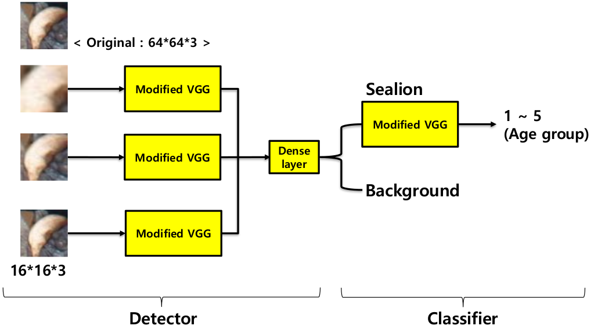
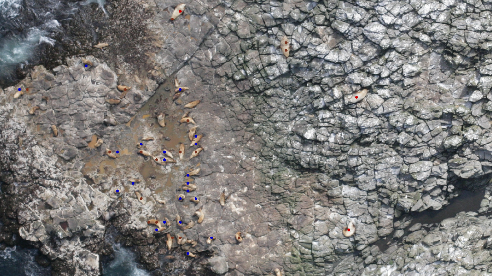
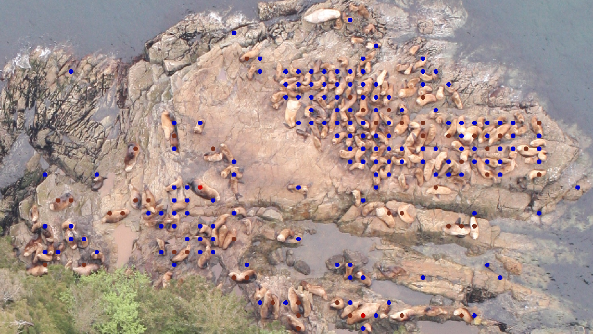
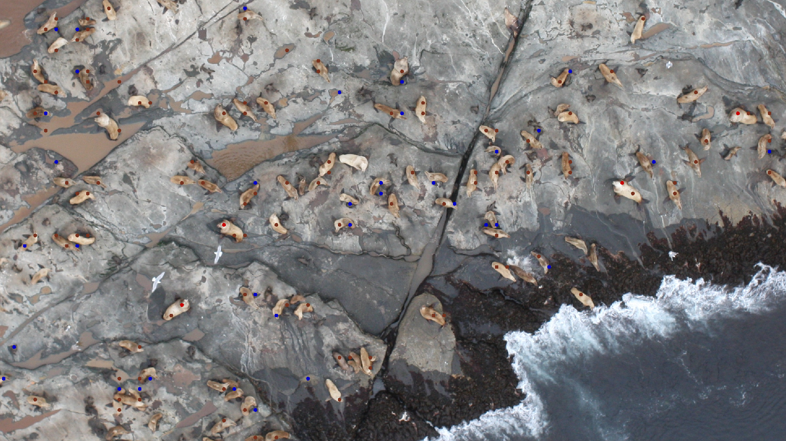

## Sealion detection and classification

Detail is described in the [paper](http://vi.kaist.ac.kr/wp-content/uploads/2018/01/iw-fcv2018_final_youngchul.pdf)
This code was used for [NOAA sealion competition](https://www.kaggle.com/c/noaa-fisheries-steller-sea-lion-population-count) in KAGGLE and final result is **58th**.

### Prerequisites

Hardware
```
Nvidia GPU with at least 3GB memory
```
Interpreter and Operating System
```
Python version 2.7 or 3.5
Tested on UBUNTU 16.04 and Windows
```
Dependency
```
tensorflow-gpu
python-opencv
imgaug
numpy
csv
skimage
```
### Installing and demo

You have to download this repository and also pre-trained model.

```
pre-trained model download link : https://drive.google.com/open?id=0Bwaxr_eelTFyS0Vyc2NfajJNb1E
```
You have to depress the 'sealion_count_model.zip' into 'input' directory.

### Running the tests

You can run the control.py (EX. python2 control.py).

The code will show you the detection&classification result on sample images.


### About this code

The detector is applied on image through sliding-window method. And there are some tricks to make it faster.

The network is like below. The network is separated into detection part and classification part.


Here are several results of code.




### Acknowledgments

This repository is being updated frequently.
